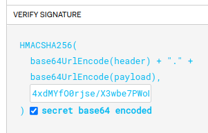

# jwt-validator
> ### Aplicação de leitura de Token JWT

Este projeto implementa uma aplicação em Spring Boot que expõe uma API para validar tokens JWT. 
A validação é baseada em critérios como número de claims, conteúdo das claims e uso da biblioteca JJWT para manipulação de tokens JWT.

#### Dependências:
O projeto utiliza como principal dependências para a resolução de cenários:

        <dependency>
            <groupId>io.jsonwebtoken</groupId>
            <artifactId>jjwt</artifactId>
            <version>0.9.1</version>
        </dependency>

#### Componentes do Projeto:
- JwtValidator.java  
Componente responsável pela validação do JWT. Ele verifica se o JWT possui exatamente 3 claims e se o conteúdo de cada claim atende aos critérios especificados.

- JwtValidationService.java  
Serviço que utiliza o JwtValidator para realizar a validação de tokens JWT.

- JwtValidationController.java  
Controlador REST que expõe um endpoint para validar tokens JWT através do serviço JwtValidationService.

#### Testes Unitários  
Os testes unitários são implementados com o framework JUnit e Mockito para simular o comportamento do JwtValidator.

> ### Executando o Projeto
Para executar o projeto localmente siga os passos:

- Clone o repositório.
- Importe o projeto em sua IDE preferida como um projeto Maven.
- Execute a classe principal Application.java como uma aplicação Spring Boot.
- Abra o navegador e acesse a aplicação em http://localhost:8080/swagger-ui/index.html.

Foi considerado uma camada de segurança, onde para reproduzir testes com as massas jwt, é necessário 'assinar' o token adicionando uma secret válida:   
Chave:  4xdMYfO0rjse/X3wbe7PWoDDKtWnYLZaIhMIYYAFBA4=

Somente com essa assinatura o token será lido.

> ### Componentes do arquivo de infraestrutura (Terraform):

- ecr.tf -
Repositório de imagens que armazenará as imagens docker da aplicação.
- ecs-cluster.tf -
 Definição da criação do cluster ECS.
- ecs-service.tf - 
 Definições de execução do cluster.
- iam.tf - 
 Configuração do usuário de criação dos componentes.
- lb.tf -
 Configuração de load balancer do cluster.
- main.tf - 
 Definição de padrões da aplicação terraform.
- task-definition.tf - 
 Configurações da imagem docker que irá rodar no cluster.
- vpc.tf - 
 Configurações de rede e conexões das máquinas.

Principais comandos para executar o terraform e ter a criação da infraestrutura:

terraform init  
terraform apply

> ### Esteira/Pipeline CI/CD

Criado um deploy simples que irá realizar os passos abaixo:

- Logar na AWS.
- Executar os comandos terraform init e apply para criar a infraestrutura em nuvem.
- Gerar uma imagem docker da aplicação.
- Subir a imagem gerada para um repositório ECR na AWS.
- Utilizar a imagem gerada no cluster ECS criado.
